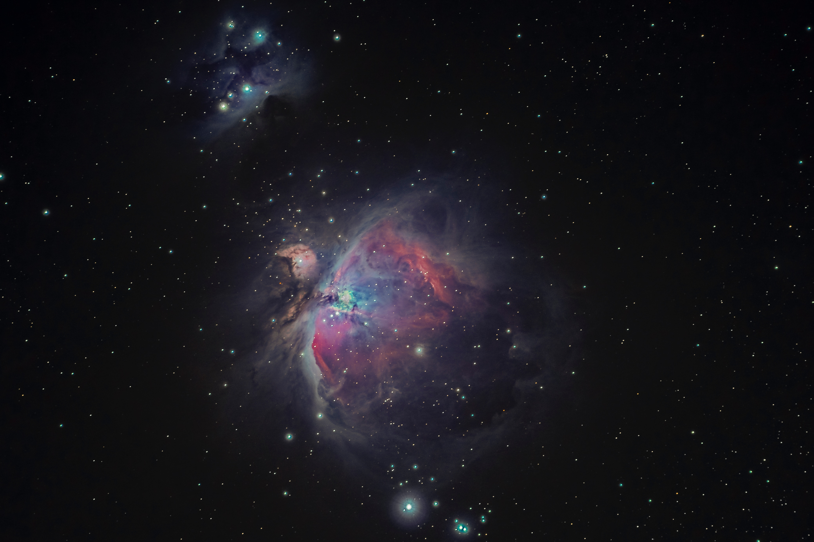

# Contents <!-- omit in toc -->

* [Usage](#usage)
* [Develop](#develop)
  * [Requirements](#requirements)
    * [WeChatWebDevTools](#wechatwebdevtools)
    * [Node.js](#nodejs)
  * [Code](#code)
    * [Structure](#structure)
    * [Components](#components)
      * [Basic](#basic)
      * [miniprogram-component-plus](#miniprogram-component-plus)
* [Contributing](#contributing)
* [Acknowledgements](#acknowledgements)
  * [Logo](#logo)
* [License](#license)

# Usage

<p align="center"></p>

Scan the QR-Code above in WeChat.

# Develop
## Requirements
### WeChatWebDevTools

Download **WeChatWebDevTools (微信开发者工具)** from the [official website](https://developers.weixin.qq.com/miniprogram/en/dev/devtools/devtools.html) ([官网](https://developers.weixin.qq.com/miniprogram/dev/devtools/devtools.html)).

Homebrew users can install by
```
brew install wechatwebdevtools
```

### Node.js

**[Node.js](https://github.com/nodejs/node)** is needed to install packages.

Homebrew users can install by
```
brew install node
```

## Code

Open the [src](./src) folder in WeChatWebDevTools.

### Structure

* [app.js](src/app.js): Mini-program logic
* [app.json](src/app.json): Common configurations for mini-program
* [app.wxss](src/app.wxss): Common style sheet for mini-program
* [pages](src/pages): Different pages
  * *.js: Page logic
  * *.wxml: Page structure
  * *.json: Page configuration
  * *.wxss: Page style sheet
* [utils](src/utils):
  * [Mixins.js](src/utils/Mixins.js): Add mixins function
  * [themeChanged.js](src/utils/themeChanged.js): Change theme between light/dark mode
* [theme.json](src/theme.json): Theme configurations.

### Components
#### Basic

```
"useExtendedLib": {
  "weui": true
}
```

#### miniprogram-component-plus

* index-list
  * modified display for numbers
  * fixed vibration
* tabs
  * different heights for subpages

# Contributing

* Feedback in Astrolator
* Create an issue:
  1. Click the "Issues" buttom: 
  2. Search for existing issues: 
  3. If not found, click the green button to open a new issue.
* Create a pull request:
  1. Fork the repository: 
  2. Edit the code in your own repository.
  3. Commit your modification to your own repository (`git commit -m 'Add something'`).
  4. Push to the Branch (`git push`).
  5. Click the "Pull request" buttom in **this repository**: 
  6. Click the green button to create a pull request: 
  7. Click "compare across forks" and choose your fork: 
  8. Create a pull request.

# Acknowledgements
## Logo

[](https://unsplash.com/photos/f7YQo-eYHdM)

A great photo taken by [Bryan Goff](https://unsplash.com/@bryangoffphoto) @ Unsplash.

> My photo of the Orion Nebula was taken in my backyard in Petaluma, California. It is composed of 60 images at 60 seconds each. I stacked them all to reduce noise and bring out the amazing details you see in the nebula . I think it is one of my better images. I hope you enjoy it. I’m on IG @bryangoffphoto Stop by and say hi!

<!--## Contributors

## Donators-->

# License

[MIT License](LICENSE)
